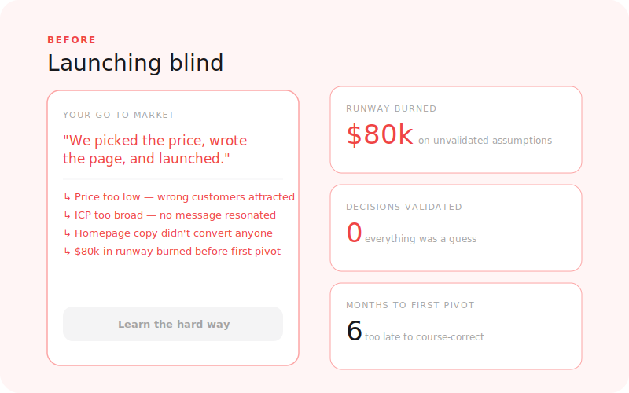
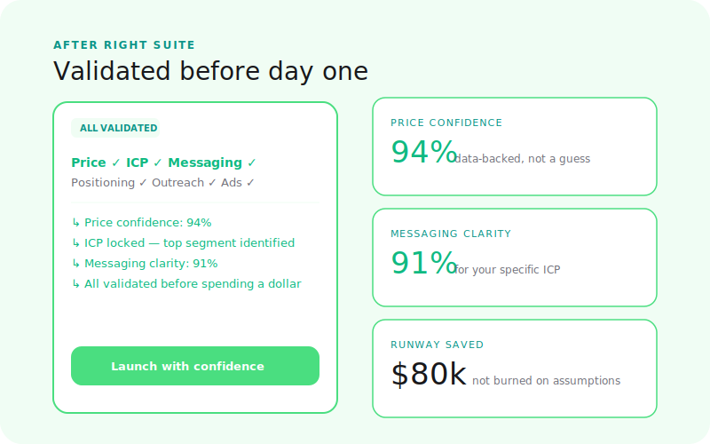
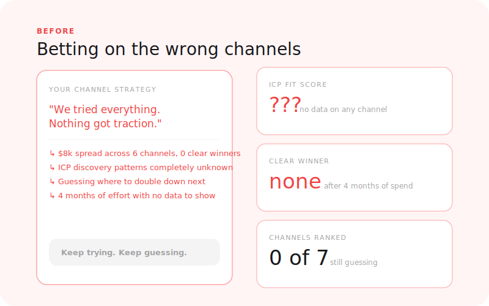
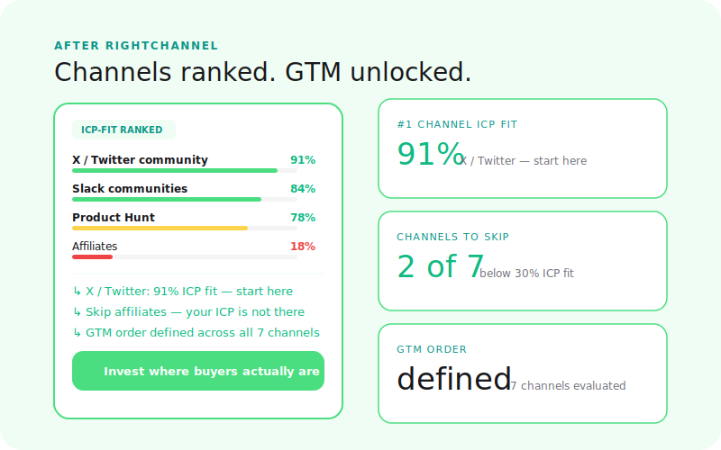
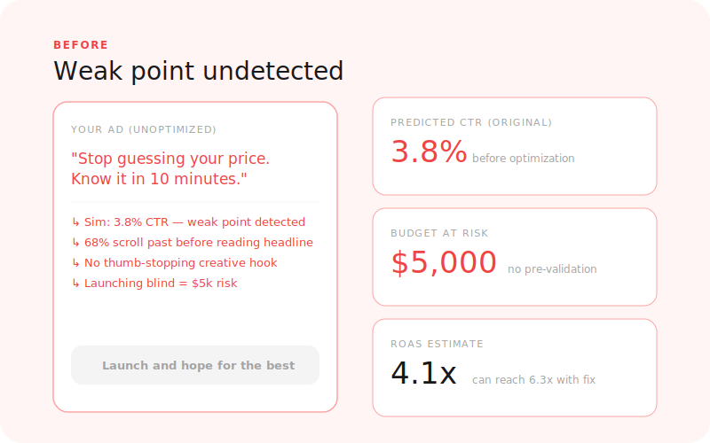
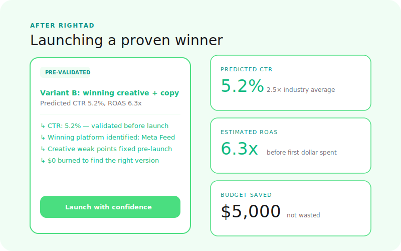

<p align="center">
  
</p>

<h1 align="center">Right Suite</h1>

<p align="center">
  <strong>You built the product. Now get the go-to-market right.</strong>
</p>

<p align="center">
  7 AI-powered tools that validate every go-to-market decision — your price, message, audience, positioning, outreach, channels, and ads — before you spend a dollar finding out the hard way.
</p>

<p align="center">
  <a href="https://www.rightsuite.co"><strong>rightsuite.co</strong></a> &nbsp;·&nbsp;
  <a href="https://www.rightsuite.co/products/right-price">RightPrice</a> &nbsp;·&nbsp;
  <a href="https://www.rightsuite.co/products/right-audience">RightAudience</a> &nbsp;·&nbsp;
  <a href="https://www.rightsuite.co/products/right-messaging">RightMessaging</a> &nbsp;·&nbsp;
  <a href="https://www.rightsuite.co/products/right-positioning">RightPositioning</a> &nbsp;·&nbsp;
  <a href="https://www.rightsuite.co/products/right-engagement">RightEngagement</a> &nbsp;·&nbsp;
  <a href="https://www.rightsuite.co/products/right-channel">RightChannel</a> &nbsp;·&nbsp;
  <a href="https://www.rightsuite.co/products/right-ad">RightAd</a>
</p>

<p align="center">
  
  
  
  
  
  
  
</p>

---

## Free toolkit — sell what you built

You shipped. Now the hard part. This is for vibe coders and solo founders who have a product and need to figure out who to sell it to, what to charge, and what to say.

### Playbook
| | |
|---|---|
| [You Built It. Now Sell It.](./playbooks/zero-customer-gtm.md) | 7 decisions in the right order. Who actually wants this. Why they'd pick you. What to charge. Whether your page converts. How to reach people cold. Where to find them at scale. Whether your ad will work before you spend on it. |

### Prompt Library — 7 prompts, one for each decision

Copy into Claude, ChatGPT, or Gemini. Fill in the brackets. Get a real answer in 2 minutes.

| Prompt | The question it answers |
|--------|------------------------|
| [01 — Who actually wants this](./prompts/01-icp-validation.md) | Which type of person is most likely to pay for what I built? |
| [02 — Why would they pick me](./prompts/02-positioning-audit.md) | What makes me the obvious choice over the alternatives? |
| [03 — What should I charge](./prompts/03-price-sensitivity.md) | Is my price too high, too low, or right? |
| [04 — Does my page convert](./prompts/04-copy-scorecard.md) | Will a stranger land on my page and understand it in 5 seconds? |
| [05 — Will they reply](./prompts/05-cold-outreach-diagnostic.md) | Will my cold message get a reply or get deleted? |
| [06 — Where do I find them](./prompts/06-channel-fit.md) | Which channel should I actually go deep on first? |
| [07 — Will my ad work](./prompts/07-ad-creative-review.md) | Will this stop the scroll before I spend money finding out it doesn't? |

### Templates — fill them in, use them today

| Template | What it is |
|----------|------------|
| [Who Should I Sell To](./templates/icp-scoring-matrix.md) | Score up to 4 buyer types side by side so you can pick one and focus |
| [Landing Page Formula](./templates/landing-page-copy-formula.md) | Section-by-section formula for pages that convert people who've never heard of you |
| [Cold Email Swipe File](./templates/cold-email-swipe-file.md) | 6 cold message frameworks with real examples, subject lines, and follow-up sequences |
| [Decision Log](./templates/gtm-decision-log.md) | Write down every decision, the assumption behind it, and how you'll know if it was right |

> These are the manual versions of what Right Suite automates. Each prompt gives you one model's take. Right Suite runs 100+ simulated buyer interactions and gives you a scored report.

---

## The Problem

Most go-to-market decisions are made on gut feel. Founders copy a competitor's price, write copy that sounds good to them, pick a channel because someone on Twitter recommended it, and send cold emails based on templates found in a blog post.

The feedback loop is brutal — weeks of effort, real spend, and you still don't know if the problem was the price, the message, the audience, or the channel.

**Right Suite shortens that loop to minutes.**

Every product runs your real inputs — your actual price, your copy, your outreach, your creative — against a simulation of how your buyers respond. You get structured scores, specific objections, and actionable next steps. No panels, no waiting, no guessing.

---

## Before → After

<table>
  <tr>
    <td align="center" width="50%">
      
      <br /><sub><b>Before: gut feel, guessing, slow loops</b></sub>
    </td>
    <td align="center" width="50%">
      
      <br /><sub><b>After: validated decisions in minutes</b></sub>
    </td>
  </tr>
</table>

---

## The 7 GTM Decisions

Every go-to-market has exactly 7 decisions that determine whether it works. Right Suite covers all of them.

| # | Decision | Product | The question it answers | Status |
|---|---|---|---|---|
| 1 | **Who to sell to** | [RightAudience](./docs/products/right-audience.md) | Which segment has the highest purchase intent? | ✅ Live |
| 2 | **How to win the comparison** | [RightPositioning](./docs/products/right-positioning.md) | Why would buyers pick you over the alternatives? | ✅ Live |
| 3 | **What to charge** | [RightPrice](./docs/products/right-price.md) | Is your price right — too high, too low, or optimal? | ✅ Live |
| 4 | **What to say on your own surfaces** | [RightMessaging](./docs/products/right-messaging.md) | Does your landing page copy convert? | ✅ Live |
| 5 | **What to say cold** | [RightEngagement](./docs/products/right-engagement.md) | Will your cold emails and DMs get replies? | ✅ Live |
| 6 | **Where to invest distribution** | [RightChannel](./docs/products/right-channel.md) | Which channels are your buyers actually on? | ✅ Live |
| 7 | **Whether paid creative works** | [RightAd](./docs/products/right-ad.md) | Will your ad stop the scroll before you spend media budget? | ✅ Live |

---

## The Products

### [RightAudience](https://www.rightsuite.co/products/right-audience) — Who should you sell to?

<table>
  <tr>
    <td width="50%">
      
    </td>
    <td width="50%">
      
    </td>
  </tr>
</table>

72% of early-stage deals are lost to segment mismatch, not product quality. You can't sell to everyone — and the segment with the highest purchase intent is rarely the one you started with.

RightAudience runs your offer across dozens of buyer personas and ranks them by purchase intent, willingness to pay, and conversion likelihood. Stop guessing which segment to focus on.

**What you get:** Segment purchase intent ranking · Willingness to pay by segment · Objection breakdown by segment · ICP clarity score · Expansion map · Go-to-market sequencing

[→ Run your first audience simulation](https://www.rightsuite.co/products/right-audience) | [Full docs](./docs/products/right-audience.md)

---

### [RightPositioning](https://www.rightsuite.co/products/right-positioning) — How do buyers see you?

<table>
  <tr>
    <td width="50%">
      
    </td>
    <td width="50%">
      
    </td>
  </tr>
</table>

77% of buyers compare at least 3 options before deciding. 68% of lost deals come down to unclear differentiation, not price. You know what you do — but do buyers know why to pick you?

RightPositioning shows you how your ideal customer compares you to competitors: what makes you stand out, what makes you blend in, and the angle that makes you the obvious choice.

**What you get:** Perceived positioning map · Differentiator strength scores · Competitive blind spots · Buyer language · Positioning gaps competitors haven't claimed · Messaging recommendations

[→ Find your positioning angle](https://www.rightsuite.co/products/right-positioning) | [Full docs](./docs/products/right-positioning.md)

---

### [RightPrice](https://www.rightsuite.co/products/right-price) — Is your price right?

<table>
  <tr>
    <td width="50%">
      
    </td>
    <td width="50%">
      
    </td>
  </tr>
</table>

The average SaaS company spends 8 hours total on pricing. Ever. Meanwhile, a 1% price improvement drives 12.7% more profit. You picked your price because it felt right — but you've never tested it.

RightPrice simulates how your target audience responds to your price. You get a confidence score, a suggested optimal range, and a trial strategy recommendation — in minutes, not weeks.

**What you get:** Confidence score · Price assessment (too low / optimal / too high) · Suggested price range · 12 buyer personas · Trial strategy recommendation · Competitive context · Actionable next steps

[→ Validate your price](https://www.rightsuite.co/products/right-price) | [Full docs](./docs/products/right-price.md)

---

### [RightMessaging](https://www.rightsuite.co/products/right-messaging) — Does your copy convert?

<table>
  <tr>
    <td width="50%">
      
    </td>
    <td width="50%">
      
    </td>
  </tr>
</table>

68% of visitors leave without scrolling past the hero. You have 10 seconds before a visitor decides whether your page is worth their time. Most founders write copy that sounds good to them — not copy that resonates with buyers.

RightMessaging tests your headlines, CTAs, and landing page sections against simulated buyers. See exactly where they drop off, what creates doubt, and which rewrites would improve conversion.

**What you get:** Conversion likelihood score · Emotional resonance · Clarity score · CTA effectiveness · Objection signals · Alternative copy suggestions · Persona breakdown

[→ Test your messaging](https://www.rightsuite.co/products/right-messaging) | [Full docs](./docs/products/right-messaging.md)

---

### [RightEngagement](https://www.rightsuite.co/products/right-engagement) — Will they respond?

<table>
  <tr>
    <td width="50%">
      
    </td>
    <td width="50%">
      
    </td>
  </tr>
</table>

85% of cold outreach is deleted before the second sentence. Most founders write sequences based on templates they found online, tweak the subject line, and hope for a response — burning through their list with no signal.

RightEngagement simulates how your target buyers respond to cold emails, LinkedIn DMs, X DMs, and multi-step sequences. Know what lands before you hit send.

**What you get:** Predicted open rate · Reply intent score · Sequence drop-off analysis · Tone diagnosis · Objection signals · Optimized variants with projected uplift

[→ Run a simulation](https://www.rightsuite.co/products/right-engagement) | [Full docs](./docs/products/right-engagement.md)

---

### [RightChannel](https://www.rightsuite.co/products/right-channel) — Where should you show up?

<table>
  <tr>
    <td width="50%">
      
    </td>
    <td width="50%">
      
    </td>
  </tr>
</table>

80% of founders bet on the wrong channel first and burn 3-6 months finding out. "Pick one channel and go deep" is the right advice — but which channel? The answer depends on where your specific audience spends time and whether they're in buying mode when they're there.

RightChannel evaluates every distribution channel against your ICP — SEO, communities, Product Hunt, LinkedIn, paid, partnerships — and ranks them by where your buyers actually pay attention.

**What you get:** Channel conversion rankings · Effort-to-return matrix · Buyer discovery patterns · Channel-message fit scores · Community and partnership signals · Channel sequencing recommendation

[→ Run a simulation](https://www.rightsuite.co/products/right-channel) | [Full docs](./docs/products/right-channel.md)

---

### [RightAd](https://www.rightsuite.co/products/right-ad) — Will your ad work?

<table>
  <tr>
    <td width="50%">
      
    </td>
    <td width="50%">
      
    </td>
  </tr>
</table>

62% of ad budget is spent on creative that never stopped the scroll. You have 2 seconds before a mid-scroll buyer is gone. Most founders launch ads based on what looks good in Canva — and discover it doesn't work only after burning through a test budget.

RightAd simulates whether your paid creative stops the scroll across Meta, Google Ads, LinkedIn, TikTok, and more. Test before you spend.

**What you get:** Hook strength score · Click intent score · Audience-creative fit · Creative fatigue prediction · Objection triggers · Copy clarity score · Winning variant recommendation

[→ Run a simulation](https://www.rightsuite.co/products/right-ad) | [Full docs](./docs/products/right-ad.md)

---

## The GTM Journey

Products are designed to be run in sequence. Each one builds on the last.

```
Step 1          Step 2              Step 3          Step 4
RightAudience → RightPositioning → RightPrice  →  RightMessaging
Find your        Win the              Set the         Write copy
segment          comparison           right price      that converts
                                                           |
                                          ┌────────────────┘
                                          ↓
Step 5              Step 6          Step 7
RightEngagement →  RightChannel →  RightAd
Test cold outreach   Find the right   Test paid creative
before you send      channel          before you spend
```

You don't have to run them in order. But this sequence gives each product the richest possible input — and compounds the value of every simulation.

---

## How It Works

Every Right Suite product follows the same pattern:

**1. Describe your inputs**
Your offer, target audience, current price, copy, creative, or outreach — depending on which product you're running.

**2. Simulation runs**
Our AI simulation engine generates 100+ synthetic buyer interactions in minutes. Buyers debate your offer, react to your copy, compare you to alternatives, and decide whether to engage or walk away.

**3. Read your report**
Structured scores, specific objections, buyer language, and actionable recommendations. Not "here are some things to think about" — here is what to do next.

The entire process takes minutes. You can validate a pricing decision before your next investor call. Test a cold email before burning through your list. Check if your landing page copy converts before you run paid traffic to it.

---

## Pricing

Credits are shared across all 7 products. Run a pricing simulation, then an audience simulation, then test your copy — all on the same plan.

| Plan | Price | Credits / mo | Best for |
|------|-------|--------------|----------|
| **Starter** | $4.99/mo | 15 credits | Try it out. Run your first simulations. |
| **Growth** | $9.99/mo | 50 credits | Teams iterating on go-to-market. |
| **Scale** | $19.99/mo | 150 credits | Agencies running simulations across clients. |

**1 credit = 1 simulation.** Credits work across every product in the suite. Buy once, use anywhere.

---

## Who It's For

**SaaS founders** who are pre-traction or early-stage and need to validate go-to-market decisions without a research budget or a panel.

**Agency founders** who are repositioning their offer, testing new service lines, or helping clients with go-to-market strategy.

**Growth teams** who are iterating on pricing, copy, or outreach and need faster signal than A/B tests can provide.

Right Suite is not a replacement for talking to customers. It's what you do before you talk to customers — so you ask better questions, validate faster, and don't burn your list on copy that never had a chance.

---

## Documentation

- [RightAudience — full product docs](./docs/products/right-audience.md)
- [RightPositioning — full product docs](./docs/products/right-positioning.md)
- [RightPrice — full product docs](./docs/products/right-price.md)
- [RightMessaging — full product docs](./docs/products/right-messaging.md)
- [RightEngagement — full product docs](./docs/products/right-engagement.md)
- [RightChannel — full product docs](./docs/products/right-channel.md)
- [RightAd — full product docs](./docs/products/right-ad.md)

---

<p align="center">
  <a href="https://www.rightsuite.co"><strong>Start validating at rightsuite.co →</strong></a>
</p>

<p align="center">
  <sub>Proprietary. All rights reserved. &copy; Wednesday Solutions.</sub>
</p>
