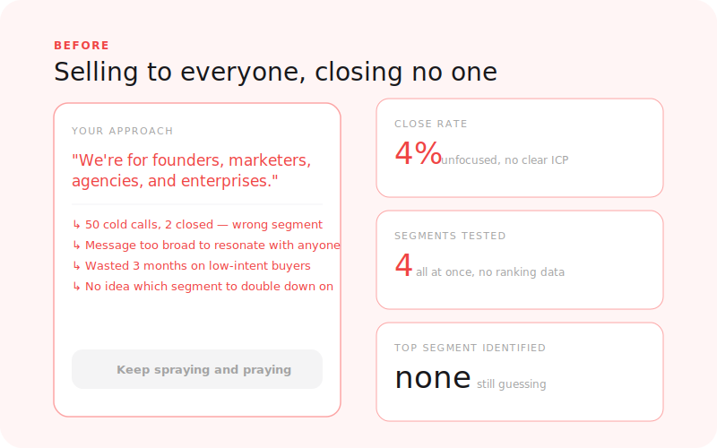
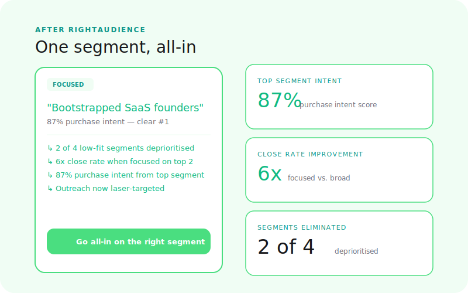

  

# RightAudience

**Who should you sell to?**

Test your offer across different customer segments. Find out which audience has the highest purchase intent for what you're building — before you commit to a go-to-market motion that targets the wrong people.

[← Back to Right Suite](../../README.md) | [→ Run a simulation](https://rightprice.co/products/right-audience)

---

## The Problem

Most founders pick an ICP based on who they know, who replied to their first outreach, or who they assume the product is for. The assumption feels reasonable — until the deal cycle is too long, the churn is too high, or the referrals don't come.

The audience with the highest purchase intent is often not the one you started with.

Selling to the wrong segment wastes sales cycles, inflates churn, and distorts your roadmap. You build features for customers who were never going to renew. You write copy for a persona that wasn't going to buy. The whole go-to-market compounds in the wrong direction.

> 72% of early-stage deals are lost to segment mismatch, not product quality.

---

## How It Works

**1. Describe your offer and segments**
Share what you're building, the problem it solves, and the 2-4 segments you're considering targeting. You don't need polished copy — rough descriptions work.

**2. Simulation runs**
The simulation tests your offer across multiple synthetic buyer segments with different demographics, roles, seniority levels, and pain profiles. Buyers evaluate whether your offer solves a real problem for them, how urgently they'd act on it, and what it would take to make them buy.

**3. Read your report**
A ranked scorecard of your candidate segments — by purchase intent, willingness to pay, and conversion likelihood. You'll see what drives each segment's intent and what holds them back.

---

## What You Get

| Output | What it tells you |
|--------|-------------------|
| **Segment purchase intent ranking** | Which customer types are most likely to buy, in order |
| **Willingness to pay by segment** | Expected price sensitivity across different audience profiles |
| **Objection breakdown by segment** | What holds each audience back from buying |
| **ICP clarity score** | How well your current positioning speaks to your ideal customer |
| **Expansion map** | Adjacent segments you could unlock after your primary beachhead |
| **Go-to-market sequencing** | Recommended order to attack segments based on conversion probability |

---

## Before / After

<table>
  <tr>
    <td align="center" width="50%">
      
       <b>Before: guessing which segment to focus on</b>
    </td>
    <td align="center" width="50%">
      
       <b>After: ranked segment scorecard in minutes</b>
    </td>
  </tr>
</table>

---

## Run RightAudience First

RightAudience is step 1 in the GTM journey because every downstream decision depends on knowing who you're selling to:

- **RightPositioning** needs a target segment to evaluate competitive perception against
- **RightPrice** needs a target segment to model price sensitivity for
- **RightMessaging** needs a target persona to test copy against
- **RightEngagement** needs a target persona to model outreach response from

You can run any product without RightAudience — but the results will be sharper once you know your segment.

---

## What RightAudience Is Not

- **Not RightPositioning** — RightAudience tells you who to sell to. RightPositioning tells you how to win the comparison against competitors for that segment.
- **Not RightMessaging** — RightAudience ranks segments by purchase intent. RightMessaging tests whether your copy converts that segment.
- **Not RightChannel** — RightAudience identifies who your buyers are. RightChannel tells you where to reach them.

---

## Status

**Live** — available at [rightprice.co/products/right-audience](https://rightprice.co/products/right-audience)

---

[← Back to Right Suite](../../README.md)
