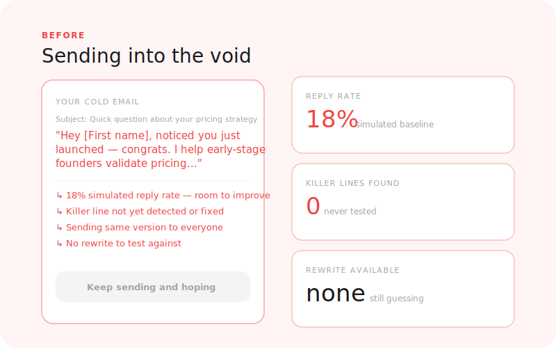
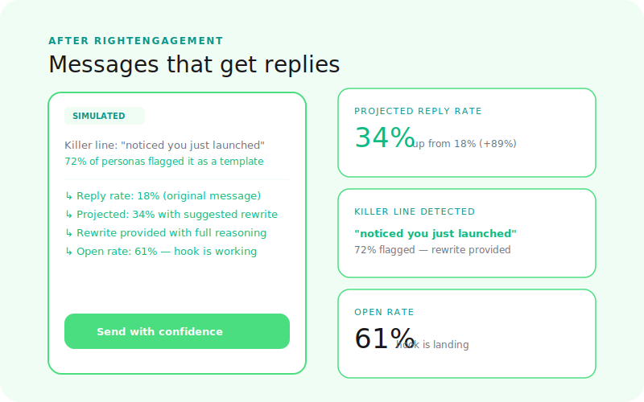

  

# RightEngagement

**Will they respond?**

Simulate cold emails, LinkedIn messages, and outreach sequences. See open rates, reply intent, and drop-off points before you burn through your list.

[← Back to Right Suite](../../README.md) | [→ Run a simulation](https://www.rightsuite.co/products/right-engagement?utm_source=docs&utm_medium=referral&utm_campaign=docs&utm_content=productdoc-right-engagement)

---

## The Problem

Cold outreach is a numbers game — but it doesn't have to be a blind one.

Most founders write sequences based on templates they found online, tweak the subject line, and hope for a response. There's no way to know if the message is genuinely compelling to your ICP until you've sent it to hundreds of people. By then, you've burned through the list, and the people who saw your weak opener aren't going to respond to a better one.

> 85% of cold outreach is deleted before the second sentence. 2x higher reply rate when the message matches what the recipient is dealing with right now.

The problem isn't personalization — AI has commoditized that. The problem is relevance: does your message speak to a real pain the buyer has right now, in a way that doesn't feel like outreach?

---

## How It Works

**1. Submit your outreach**
Paste your cold email, LinkedIn message, DM, or full multi-step sequence, along with your target persona description.

**2. Simulation runs**
The simulation generates synthetic buyer responses across your target audience, modeling open behavior, read-through rate, reply intent, and the exact point where momentum drops off in multi-step sequences.

**3. Read your report**
Predicted engagement rates, tone diagnosis, objection signals surfaced by your message, and rewritten variants with projected uplift for each.

---

## What You Get

| Output | What it tells you |
|--------|-------------------|
| **Predicted open rate** | Likelihood your subject line gets opened by your target audience |
| **Reply intent score** | How motivated synthetic buyers are to respond after reading |
| **Sequence drop-off analysis** | Which message in a multi-step sequence loses momentum |
| **Tone diagnosis** | Is your outreach coming across as genuine, pushy, salesy, or unclear? |
| **Objection signals** | What concerns surface in simulated buyer reactions |
| **Optimized variants** | Rewritten subject lines and openers ranked by predicted engagement |

---

## Before / After

<table>
  <tr>
    <td align="center" width="50%">
      
       <b>Before: sending blind and burning your list</b>
    </td>
    <td align="center" width="50%">
      
       <b>After: knowing what lands before you hit send</b>
    </td>
  </tr>
</table>

---

## Supported Outreach Formats

- Cold email (single send or multi-step sequence)
- LinkedIn DM
- X (Twitter) DM
- Slack community message
- Any 1:1 direct outreach format

---

## RightEngagement vs. RightMessaging

| | RightEngagement | RightMessaging |
|---|---|---|
| **Where the content lives** | In their inbox — uninvited | On your surfaces — they came to you |
| **Buyer psychology** | High resistance, no context, delete by default | Active interest, willing to read |
| **Primary variable** | Reply intent, tone, does it feel like spam? | Conversion likelihood, clarity, CTA click |
| **Use it for** | Cold email, DMs, outreach sequences | Landing pages, emails to your list, announcements |

---

## Where RightEngagement Fits

RightEngagement is step 5 in the GTM journey:

1. **RightAudience** — Know who you're reaching out to
2. **RightPositioning** — Know your angle
3. **RightPrice** — Know the offer you're pitching
4. **RightMessaging** — Know what copy converts on your own surfaces
5. **RightEngagement** — Test cold outreach before burning your list

You can run RightEngagement without the earlier steps — but knowing your ICP and positioning makes the outreach test sharper.

---

## Status

**Live** — available at [www.rightsuite.co/products/right-engagement](https://www.rightsuite.co/products/right-engagement?utm_source=docs&utm_medium=referral&utm_campaign=docs&utm_content=productdoc-right-engagement)

---

[← Back to Right Suite](../../README.md)
