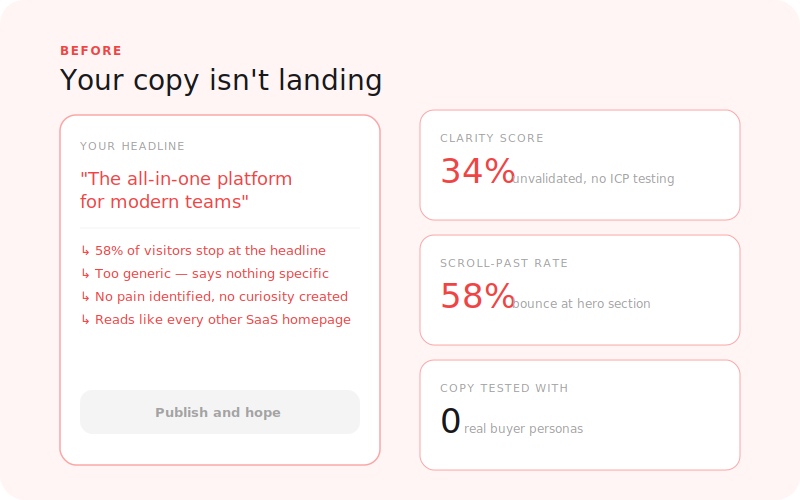
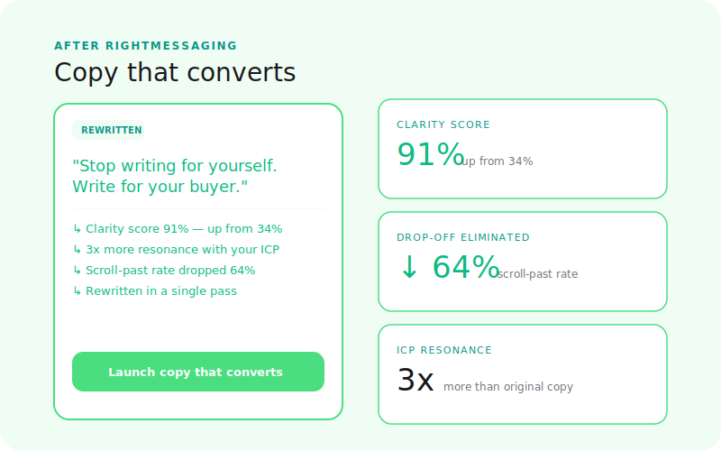

  

# RightMessaging

**Does your copy convert?**

Test your headlines, CTAs, and landing page sections against simulated buyers. Find the words that make people click — before you publish, before you run paid traffic, before you miss your launch window.

[← Back to Right Suite](../../README.md) | [→ Run a simulation](https://rightprice.co/products/right-messaging)

---

## The Problem

Most founders write copy based on what sounds good to them, not what resonates with buyers. A headline that feels clever internally can fall completely flat with the audience it's meant to reach.

By the time you know the copy doesn't convert, you've already committed to it. The ads are running. The emails are out. The launch post is live.

> 68% of visitors leave without scrolling past the hero. You have 10 seconds before a visitor decides whether your page is worth their time. 3x higher conversion when copy matches what the reader already believes.

The problem with copy is that everyone has an opinion about it and nobody has data. RightMessaging replaces opinions with signal.

---

## How It Works

**1. Submit your copy**
Paste your headline, hero section, CTA, email subject, or any organic content you're publishing on your own surfaces. You can test a single line or a full landing page section.

**2. Simulation runs**
The simulation tests your copy against synthetic buyers matching your target audience. Buyers read your copy, react emotionally, form objections, decide whether to click or leave, and surface what they actually understood vs. what you meant to say.

**3. Read your report**
A line-by-line breakdown showing conversion likelihood, emotional response at each section, clarity scores, and specific copy variants ranked by predicted performance.

---

## What You Get

| Output | What it tells you |
|--------|-------------------|
| **Conversion likelihood score** | Probability your copy drives the desired action |
| **Emotional resonance** | How your message lands — excited, skeptical, confused, intrigued |
| **Clarity score** | Do buyers understand what you're offering at a glance? |
| **CTA effectiveness** | Does your call to action create urgency and drive clicks? |
| **Objection signals** | What questions or doubts does your copy trigger? |
| **Alternative copy suggestions** | AI-generated variants ranked by simulated performance |
| **Persona breakdown** | Which buyer types respond best and worst to your messaging |

---

## Before / After

<table>
  <tr>
    <td align="center" width="50%">
      
       <b>Before: copy that sounds good internally</b>
    </td>
    <td align="center" width="50%">
      
       <b>After: copy validated against real buyer reactions</b>
    </td>
  </tr>
</table>

---

## RightMessaging vs. RightEngagement vs. RightAd

These three products all involve testing written content, but they cover different surfaces with different buyer psychology:

| Surface | Product | Why it's different |
|---------|---------|-------------------|
| Landing page, email newsletter, blog post | **RightMessaging** | Browse context — the buyer is on your turf, opted in |
| Cold email, LinkedIn DM, X DM | **RightEngagement** | Inbox context — the buyer didn't ask for it, much higher resistance |
| Meta ad, Google ad, LinkedIn ad | **RightAd** | Feed context — competing for attention in 2 seconds, scroll-stop is the primary variable |

Use RightMessaging for copy on surfaces you own. Use RightEngagement for cold outreach. Use RightAd for paid creative.

---

## Where RightMessaging Fits

RightMessaging is step 4 in the GTM journey:

1. **RightAudience** — Know who you're writing for
2. **RightPositioning** — Know the angle that makes you the obvious choice
3. **RightPrice** — Know the price you're writing copy around
4. **RightMessaging** — Write copy that converts, using what you learned in steps 1-3

You can run RightMessaging on its own — but the results compound when your copy is already informed by a clear segment, positioning angle, and validated price.

---

## Status

**Live** — available at [rightprice.co/products/right-messaging](https://rightprice.co/products/right-messaging)

---

[← Back to Right Suite](../../README.md)
