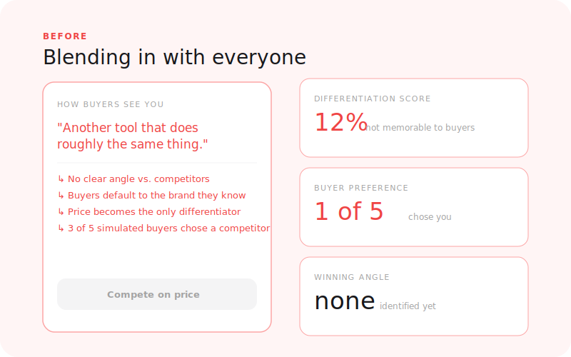
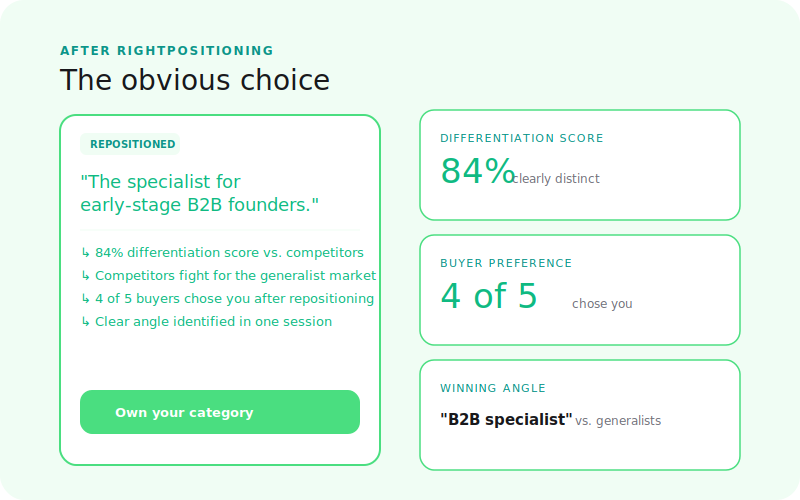

  

# RightPositioning

**How do buyers see you?**

Discover how your audience perceives you next to competitors. Find the angle that makes you the obvious choice — before you spend months on marketing that fights from the wrong position.

[← Back to Right Suite](../../README.md) | [→ Run a simulation](https://www.rightsuite.co/products/right-positioning)

---

## The Problem

Most founders think they know how they're positioned. They have a tagline, a comparison table, a "why us" section. The messaging was workshopped, the differentiators were debated, the competitive matrix was built.

But buyers rarely experience your positioning the way you intend it.

They compare you to alternatives you haven't considered. They dismiss differentiators you thought were compelling. They remember messaging you never intended to lead with. And they're doing all of this in 30 seconds, without reading your comparison table.

> 77% of buyers compare at least 3 options before deciding. 68% of lost deals come down to unclear differentiation, not price.

---

## How It Works

**1. Describe your offer and competitors**
Share your product, the key claims you make, and who you compete with — directly or indirectly. You don't need a polished deck. A paragraph describing what you do and who you're up against is enough.

**2. Simulation runs**
The simulation generates synthetic buyer conversations where buyers evaluate your offer in the context of alternatives. Buyers compare, debate, object, and decide — producing a realistic picture of how your positioning lands in a real evaluation.

**3. Read your report**
A positioning map showing where buyers mentally place you, which differentiators they believe, which competitors they bring up that you didn't mention, and the gaps your competitors haven't claimed that you could own.

---

## What You Get

| Output | What it tells you |
|--------|-------------------|
| **Perceived positioning map** | Where buyers mentally place you relative to alternatives |
| **Differentiator strength scores** | Which of your claimed advantages buyers actually believe |
| **Competitive blind spots** | Competitors buyers compare you to that you haven't considered |
| **Buyer language** | The exact words buyers use to describe you (and your competitors) |
| **Positioning gaps** | Angles competitors haven't claimed that you could own |
| **Messaging recommendations** | How to reframe your positioning to become the obvious choice |

---

## Before / After

<table>
  <tr>
    <td align="center" width="50%">
      
       <b>Before: positioning that sounds right internally</b>
    </td>
    <td align="center" width="50%">
      
       <b>After: the angle buyers actually respond to</b>
    </td>
  </tr>
</table>

---

## Where RightPositioning Fits

RightPositioning is step 2 in the GTM journey:

1. **RightAudience** — Find your segment (who has the highest purchase intent)
2. **RightPositioning** — Win the comparison for that segment
3. **RightPrice** — Price correctly for that segment
4. **RightMessaging** — Write copy that converts, informed by the positioning angle

Run RightAudience first if you're unsure which segment to position for. Run RightPositioning before writing your landing page — the output tells you which angles to lead with.

---

## What RightPositioning Is Not

- **Not RightAudience** — RightPositioning assumes you know who you're selling to. Use RightAudience first to identify your segment.
- **Not RightMessaging** — RightPositioning surfaces the angle. RightMessaging tests whether your copy executes that angle effectively.
- **Not RightPrice** — RightPositioning surfaces competitive price perception, but it doesn't score your specific price. Use RightPrice for that.

---

## Status

**Live** — available at [www.rightsuite.co/products/right-positioning](https://www.rightsuite.co/products/right-positioning)

---

[← Back to Right Suite](../../README.md)
