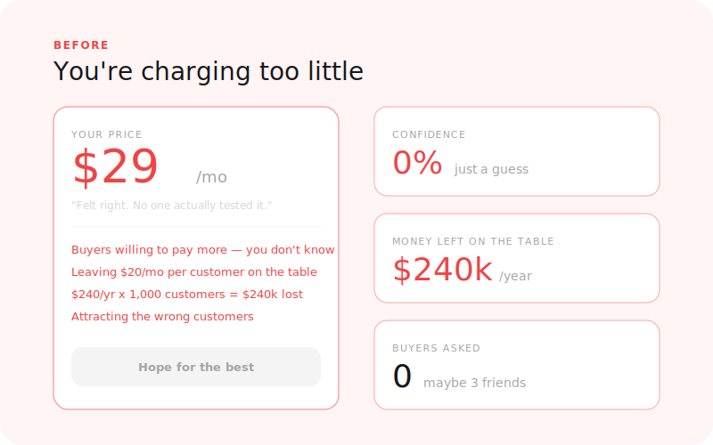
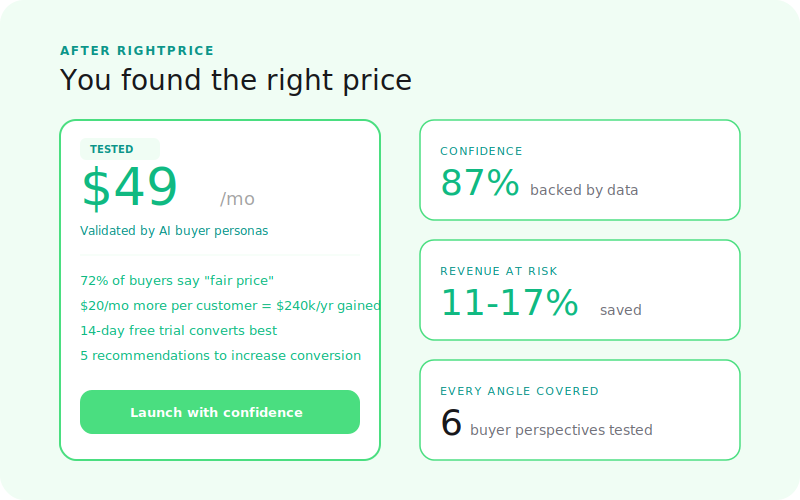

  

# RightPrice

**Is your price right?**

AI-powered pricing validation for SaaS and agency founders. Get a confidence score, a data-backed optimal range, and a trial strategy recommendation — in minutes, not weeks.

[← Back to Right Suite](../../README.md) | [→ Run a simulation](https://rightprice.co/products/right-price)

---

## The Problem

Founders spend an average of 8 hours total on pricing for their entire business. Most pricing decisions are based on gut feel, competitor copying, or a quick Google search. You picked your price because it felt right — but you've never tested it.

That matters more than most founders realize.

> A 1% improvement in pricing drives 12.7% more profit (Price Intelligently). Meanwhile, 11-17% of SaaS revenue is lost to wrong pricing.

The problem isn't that founders don't care about pricing. It's that the feedback loop is brutal. You change your price, wait weeks, and still aren't sure if the change worked or something else did. RightPrice shortens that loop to minutes.

---

## How It Works

**1. Describe your offer**
Your product name, description, current price, target audience, and whether you're SaaS or agency. No polished deck needed — a paragraph is enough.

**2. Simulation runs**
The simulation generates 100+ synthetic buyer interactions across your target audience. Buyers evaluate your price in context — comparing it to alternatives, reacting to the value proposition, surfacing objections, and signaling whether they'd pay it or walk away.

**3. Read your report**
A structured validation report with an overall sentiment score, confidence rating, price assessment, optimal range, buyer personas, and specific recommendations for your trial strategy.

---

## What You Get

| Output | What it tells you |
|--------|-------------------|
| **Overall sentiment** | Are simulated buyers positive, mixed, or negative about your pricing? |
| **Confidence score** | How reliable is this assessment given your inputs? |
| **Price assessment** | Too low / optimal / too high / needs adjustment |
| **Suggested price range** | Data-backed optimal pricing band for your segment |
| **12 buyer personas** | Simulated buyers with demographics, willingness to pay, objections, and excitement signals |
| **Trial strategy recommendation** | Free trial, freemium, reverse trial, or paid pilot — with reasoning |
| **Competitive context** | How your price positions against the simulated market |
| **Actionable recommendations** | Specific next steps based on the findings |

---

## Before / After

<table>
  <tr>
    <td align="center" width="50%">
      
       <b>Before: a price picked on gut feel</b>
    </td>
    <td align="center" width="50%">
      
       <b>After: confidence score and optimal range</b>
    </td>
  </tr>
</table>

---

## Where RightPrice Fits

RightPrice is step 3 in the GTM journey:

1. **RightAudience** — Know who you're pricing for (purchase intent by segment)
2. **RightPositioning** — Know how your price compares to how buyers perceive you vs. competitors
3. **RightPrice** — Set the right price for your validated segment
4. **RightMessaging** — Write copy that converts at that price

You can run RightPrice on its own without running RightAudience first — but the results are sharper when you know exactly which segment you're pricing for.

---

## What RightPrice Is Not

- **Not RightMessaging** — RightPrice validates whether buyers will pay your price. RightMessaging validates whether your copy convinces them to click.
- **Not RightAudience** — RightPrice assumes you know who you're selling to. Use RightAudience first to identify which segment to price for.
- **Not RightPositioning** — RightPositioning surfaces competitive price perception. RightPrice scores your specific price against your specific audience.

---

## Status

**Live** — available at [rightprice.co/products/right-price](https://rightprice.co/products/right-price)

---

[← Back to Right Suite](../../README.md)
